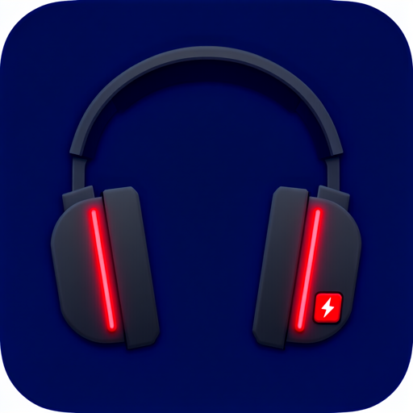

# ROGDeltaTray

<p align="center"></p>

在 Windows 任务栏托盘直接显示 **ROG Delta II（棱镜 2）** 耳机的实时电量——无需安装/运行 Armoury Crate。

A lightweight Windows tray app that shows your **ASUS ROG Delta II** headset's battery level right in the system tray — no Armoury Crate required.


<!-- Screenshot: docs/screenshot.png -->

---

## 这个项目是干什么的 / What this project is

ROG Delta II 耳机本身没有屏幕，想看电量只能打开 Armoury Crate（奥创中心）——一个庞大、常驻后台、启动缓慢的软件。本项目通过逆向其 2.4G 无线接收器的 HID 协议，用一个 **几 MB 内存占用、单文件、即开即用** 的托盘小程序取代这个需求：电量数字直接画在托盘图标上，开机挂着就行，看一眼任务栏就知道还剩多少电。

除了看电量，它还顺手解决了一个日常痛点：**耳机开机/关机时自动切换 Windows 默认音频设备**。戴上耳机声音就过去，摘下耳机声音回到音箱，不用再手动进声音设置。

The ROG Delta II has no display of its own, and the only official way to check its battery is Armoury Crate — a heavy, slow, always-running suite. This project reverse-engineered the HID protocol of the headset's 2.4 GHz dongle and replaces that need with a **tiny single-file tray app**: the battery percentage is rendered directly onto the tray icon, so a glance at the taskbar tells you the level.

As a bonus, it also fixes a daily annoyance: **automatically switching the Windows default audio devices** when the headset powers on/off. Headset on → sound goes to the headset; headset off → sound returns to your speakers.

## 功能 / Features

- **托盘图标实时显示电量数字** / Battery percentage rendered into the tray icon
  - 连接时每 5 秒刷新；接收器插拔由 `WM_DEVICECHANGE` 事件即时感知，无需等待轮询（断开后保留每 2 秒探测作为兜底，耳机开机立刻能被发现）
  - 电量低于阈值（默认 20%）图标变红；耳机关机/断开显示灰色 ✕（接收器还在时右上角多一个琥珀色待机点，一眼区分「该开耳机」和「该插接收器」）；菜单可区分「接收器未插」与「耳机未开机」两种状态
  - 查询前先清空输入队列、跳过接收器主动推送的异步事件包、识别固件 NAK（参考 g-helper 的 `WriteForResponse`），单次链路抖动不会误报；接收器收到 NAK（耳机关机的确定性应答）时立即判定断开并回切音频，仅在原因不明的失败时才需要连续 3 次去抖
  - HID 查询在后台线程执行，链路抖动时托盘菜单和通知不会卡死；图标按当前 DPI 的实际托盘尺寸渲染
  - Refreshes every 5 s while connected; receiver plug/unplug is detected instantly via `WM_DEVICECHANGE` events (2 s polling kept as a fallback so power-on is caught quickly); icon turns red at ≤ 20 % and shows a grey ✕ when disconnected (with an amber standby dot when the receiver is still plugged in, so "power on the headset" is distinguishable from "plug in the receiver" at a glance); the menu distinguishes "receiver unplugged" from "headset powered off"; stale-report draining, async-event filtering and firmware-NAK handling (from g-helper's `WriteForResponse`) keep single link hiccups from causing false disconnects; a NAK (the dongle's definitive "headset off" answer) triggers an immediate disconnect/audio switch-back, while only unexplained failures go through the 3-strike debounce
  - HID queries run on a background thread so a flaky link never freezes the tray menu; icons render at the real tray size for the current DPI
- **自动切换声音输入输出** / Automatic audio device switching
  - 耳机开机 → 默认播放 + 录音设备切到 ROG 耳机（端点未就绪时自动重试几次）
  - 耳机关机 → 切回之前的音箱/麦克风（切换前的默认设备会被记住，含通信设备角色）
  - 耳机端点按设备实例 ID 里的 VID/PID 识别（重命名设备也不怕），通过 `IPolicyConfig` 设置 Windows 默认音频端点；可在右键菜单关闭此功能
  - Headset on → default playback *and* recording endpoints switch to the ROG headset (retries automatically while the endpoints register); headset off → switch back to your previously remembered devices, including the communications role (via `IPolicyConfig`); headset endpoints are recognized by the VID/PID in their device instance id, so renaming the device doesn't break detection; can be disabled from the tray menu
- **右键菜单** / Tray menu：查看电量、续航估算、立即刷新、低电量阈值、开关连接提示、开关自动切换、固定回切设备、开关开机自启、切换语言、退出
- **中英文界面** / Chinese & English UI：默认跟随 Windows 显示语言，可在「语言 / Language」子菜单手动切换，即时生效（Follows the Windows display language by default; can be overridden in the Language submenu, takes effect immediately）
- **低电量提醒** / Low-battery alerts：阈值可在菜单配置（10–30%），≤阈值 / ≤10% / ≤5% 分级各提醒一次，电量回升后重新武装（Configurable threshold 10–30 %; tiered alerts at threshold / 10 % / 5 %, re-armed once the battery rises again）
- **续航/充电估算** / Runtime & charge estimates：记录电量采样（仅存变化点和心跳，保留 7 天、上限 2000 条，约 60 KB），菜单显示预计剩余可用时间；充电时反向估算预计充满时间，放电速率不受充电段干扰（Samples recorded only on change or 30-min heartbeat, kept 7 days / ≤ 2000 entries ≈ 60 KB; menu shows estimated remaining runtime, or time-to-full while charging; charge sessions don't pollute the measured drain rate）
- **连接/断开气泡提示** / Connect/disconnect balloon notification（可在菜单关闭，左键点击图标查看电量详情）
- **固定回切设备** / Fixed fallback audio device：耳机关机后可固定回切到指定音箱/麦克风，而非仅自动记忆（可在「回切播放/录音设备」子菜单选择）
- **对外输出电量状态** / Battery state for external tools：
  - 状态实时写入 `%APPDATA%\RogBatteryTray\status.json`（连接状态、电量、充电中、预计剩余分钟数、更新时间），Rainmeter / Stream Deck / AutoHotkey 等可直接读取
  - 命令行运行 `RogBatteryTray.exe --query` 立即查询一次并以 JSON 打印（退出码：0 已连接 / 1 错误 / 2 未连接）
  - Live state is written to `%APPDATA%\RogBatteryTray\status.json` (connected, percent, charging, estimated remaining minutes, timestamp) for Rainmeter / Stream Deck / AutoHotkey etc.; `RogBatteryTray.exe --query` prints the same JSON once and exits (exit code: 0 connected / 1 error / 2 not connected)
- **可选开机自启** / Optional auto-start with Windows（写注册表 `Run` 键，仅当前用户）

## 下载与使用 / Download & Usage

1. 到 [Releases](https://github.com/measureer/ROGDeltaTray/releases) 页面下载，二选一：
   - `ROGDeltaTray-v0.4.0-win-x64.exe` — **单文件自包含版（推荐）**，无需安装 .NET 运行时
   - `ROGDeltaTray-v0.4.0-win-x64-framework-dependent.exe` — 框架依赖版，体积小，但需要系统已安装 [.NET 8 桌面运行时](https://dotnet.microsoft.com/download/dotnet/8.0)
2. 双击运行即可，建议配合右键菜单里的「开机启动」使用

Download one of the exes from [Releases](https://github.com/measureer/ROGDeltaTray/releases): `...-win-x64.exe` is self-contained (recommended, no .NET install needed); `...-framework-dependent.exe` is smaller but requires the [.NET 8 Desktop Runtime](https://dotnet.microsoft.com/download/dotnet/8.0). Double-click to run — enabling "开机启动" (auto-start) from the tray menu is recommended.

## 系统要求 / Requirements

- Windows 10 / 11（x64）
- ASUS ROG Delta II 耳机（接收器 `VID 0B05 / PID 1AFA`），通过 **2.4G 无线接收器** 连接（蓝牙模式下无法查询）
- 同协议族的 ROG Cetra SpeedNova（`PID 1AD3`）也会自动尝试，未经实测，欢迎反馈

  The ROG Cetra SpeedNova (`PID 1AD3`, same protocol family) is probed automatically too — unverified, feedback welcome.

## 自行构建 / Build from source

需要 .NET 8 SDK：

```
dotnet publish src/RogBatteryTray -c Release -r win-x64 --self-contained -p:PublishSingleFile=true
```

产物 / Output: `src/RogBatteryTray/bin/Release/net8.0-windows/win-x64/publish/RogBatteryTray.exe`

## 原理 / How it works

不依赖 Armoury Crate，直接通过 USB HID 与 2.4G 接收器通信：向接收器的 vendor-defined 接口（usage page `0xFF00`，报告 `0xCC`，按报告描述符识别而非依赖 `col04` 路径名）发送 ASUS 外设统一查询命令 `CC 12 07`（与 ROG 鼠标/耳机的 `12 07` 电量查询同族），响应第 6 字节即电量百分比（0–100），第 7 字节是驱动里设置的低电量警告阈值；充电状态由单独的 `CC 12 08` 查询获得（第 5 字节为 1 即充电中，同 g-helper）。耳机关机时查询超时，据此判断连接状态。

音频切换部分使用 Windows Core Audio API 枚举端点，并通过未公开但广泛使用的 `IPolicyConfig` COM 接口设置默认设备。

完整逆向过程与协议细节（含 RACE 通道、各 HID collection 布局）见 [docs/protocol.md](docs/protocol.md)。

The app talks directly to the 2.4 GHz dongle over USB HID instead of relying on Armoury Crate: it sends the ASUS peripheral unified query `CC 12 07` (same family as the ROG mouse/headset battery query) to the dongle's vendor-defined interface (usage page `0xFF00`, report `0xCC`, identified by its report descriptor rather than the `col04` path name); byte 6 of the response is the battery percentage (0–100) and byte 7 is the low-battery warning threshold configured in the driver. Charging state comes from a separate `CC 12 08` query (byte 5 == 1 means charging, same as g-helper). Queries time out when the headset is off, which is how the connection state is detected.

Audio switching enumerates endpoints with the Windows Core Audio API and sets the defaults through the undocumented but widely used `IPolicyConfig` COM interface.

See [docs/protocol.md](docs/protocol.md) for the full reverse-engineering notes (RACE channel, HID collection layout, etc.).

## 项目结构 / Project structure

- `src/RogBatteryTray/` — 托盘应用本体（.NET 8 WinForms + HidSharp）。程序集名仍为 `RogBatteryTray`，`ROGDeltaTray` 是仓库/项目名
- `tools/HidProbe/` — HID 探测/协议验证工具（枚举设备、监听、RACE 查询/扫描），逆向时用
- `tools/WsProbe/` — ASUS 本地 WebSocket 协议探测工具（调研用，最终未采用该方案）
- `docs/protocol.md` — 逆向出的协议文档

## 已知限制 / Known limitations

- **实测仅 ROG Delta II**（`VID 0B05 / PID 1AFA`）；ROG Cetra SpeedNova（`PID 1AD3`）按同协议族自动适配但未经实测，其他型号需按 [docs/protocol.md](docs/protocol.md) 的方法重新确认
- 蓝牙耳机模式下无法查询电量（协议走 2.4G 接收器）
- Only the ROG Delta II (`VID 0B05 / PID 1AFA`) is verified on real hardware; the ROG Cetra SpeedNova (`PID 1AD3`) is auto-detected as a same-family device but untested. Other models need re-verification per [docs/protocol.md](docs/protocol.md)
- Battery query does not work over Bluetooth (the protocol goes through the 2.4 GHz dongle)

## 致谢 / Acknowledgements

- [g-helper](https://github.com/seerge/g-helper) — ROG 鼠标 `12 07` 电量查询的参考实现
- [race-toolkit](https://github.com/auracast-research/race-toolkit) 与 [Airoha RACE 协议分析](https://insinuator.net/2025/12/bluetooth-headphone-jacking-full-disclosure-of-airoha-race-vulnerabilities/)

## License

[MIT](LICENSE)
